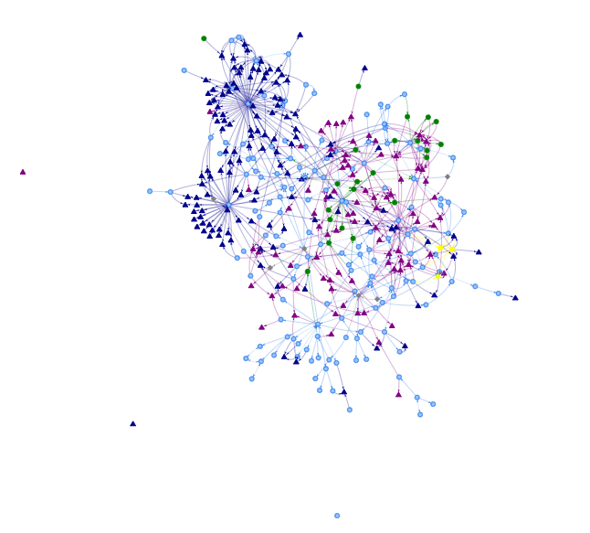

# A knowledge graph of some sorts

This is my effort to create one larger knowledge base over my blogposts, notes and links.
It is not truly a knowledge graph because I miss a lot of details
but the goal is to be able to traverse a graph (also visually) and find related articles.

To ingest the data I have hardcoded knowledge and I download the json versions _(set up because of local search)_ of 
- [blog.rmhogervorst.nl](https://blog.rmhogervorst.nl)
- [notes.rmhogervorst.nl](https://notes.rmhogervorst.nl)
- [linklog.rmhogervorst.nl](https://linklog.rmhogervorst.nl) (this is not yet online)

for now it looks like hell

